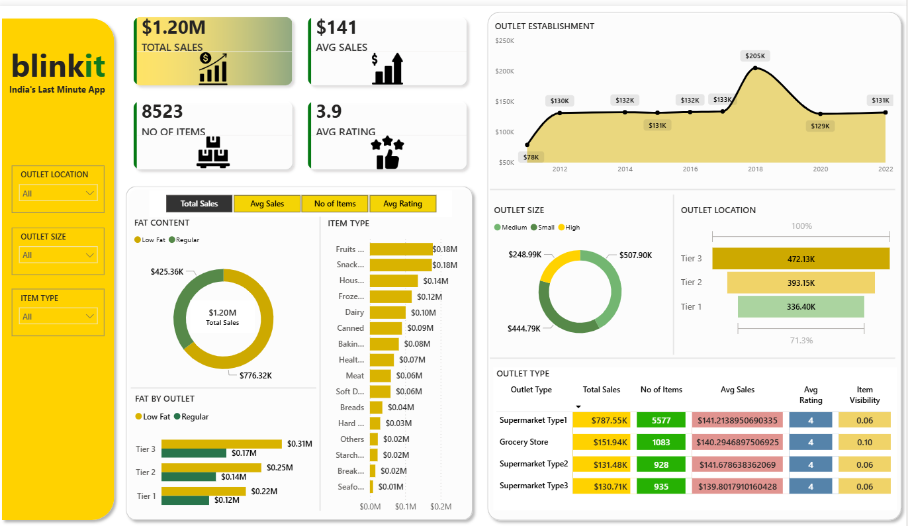
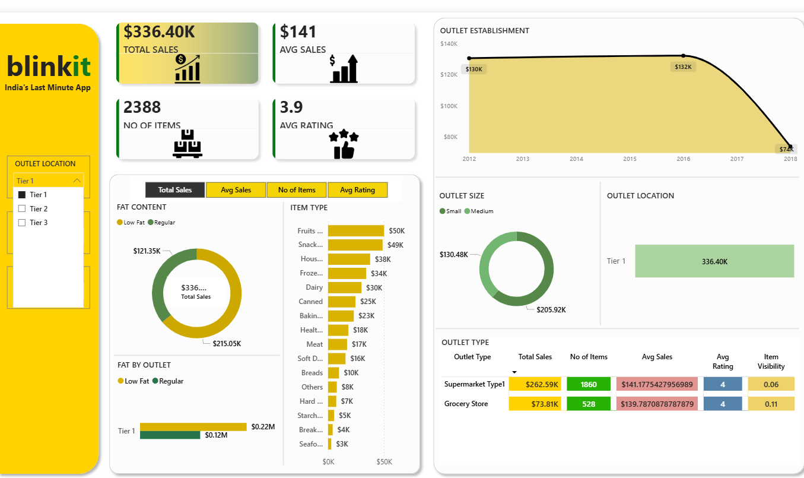
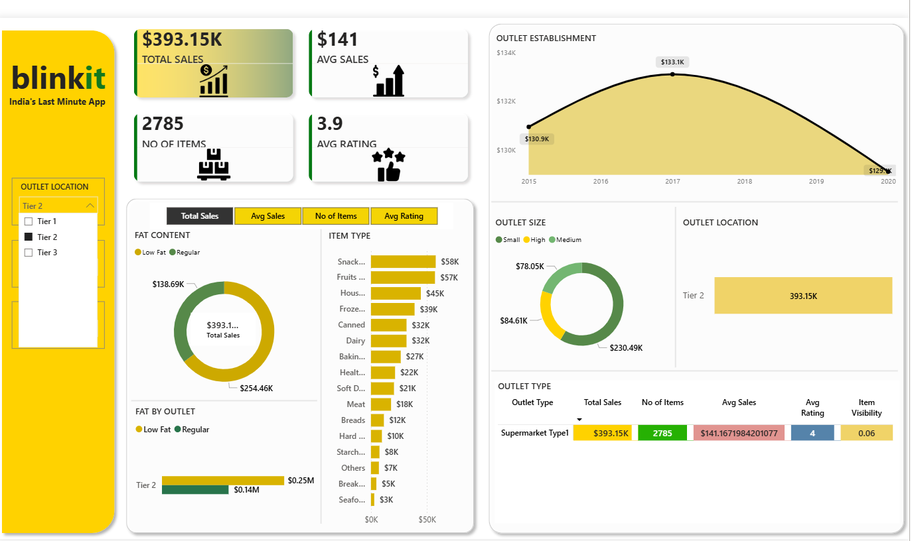
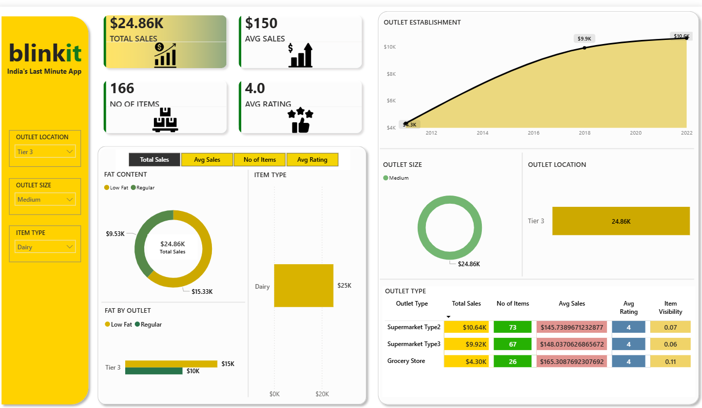
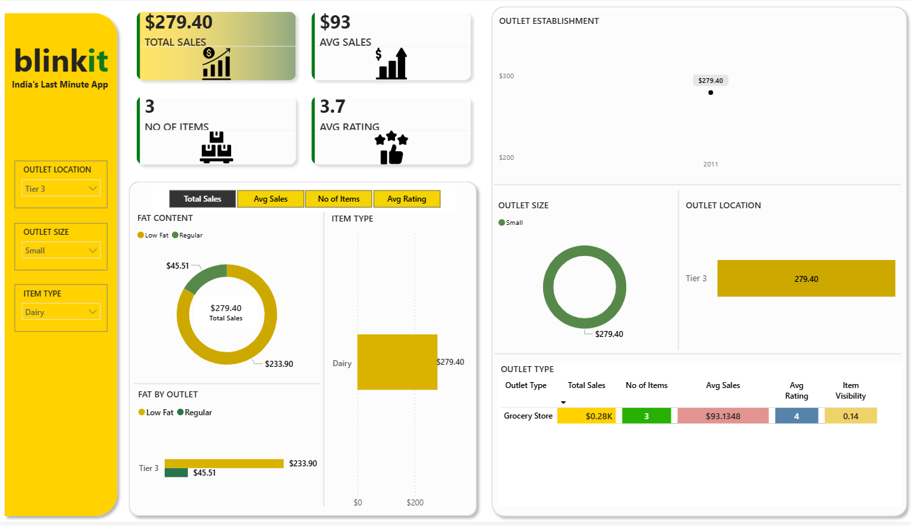

# Blinkit-sales-analysis-dashboard
 Developed an interactive Power BI dashboard for analyzing Blinkit sales performance, customer ratings, item categories, and outlet insights using Excel data.

## Dataset used
<a href="https://github.com/Sakshikumari02/Blinkit-sales-analysis-dashboard/blob/main/BlinkIT%20Grocery%20Data.xlsx">Dataset</a>

## KPIs
- Total Sales
- Total Orders
- Average Sales
- Average Rating
- Total Items Sold

-Dashboard Interaction <a href="https://github.com/Sakshikumari02/Blinkit-sales-analysis-dashboard/blob/main/Blinkit.pbix"> View Dashboard</a>

## Process
- Collected Blinkit sales dataset
- Cleaned and transformed data using Power Query
- Created KPIs using DAX measures
- Designed interactive dashboard visuals
- Added filters, slicers, and navigation buttons
- Analyzed sales trends and business insights

  ## Dashboard

## Project Insights
- Identified top-performing product categories based on sales
- Analyzed outlet performance across different locations and sizes
- Observed customer rating trends and average sales patterns
- Compared sales contribution by item type and outlet type
- Tracked overall business performance using KPI metrics

## Final Conclusion
The Blinkit Sales Dashboard provides a clear view of business performance through interactive visualizations and KPIs. It helps in understanding sales trends, customer behavior, and outlet performance, enabling better data-driven business decisions.
